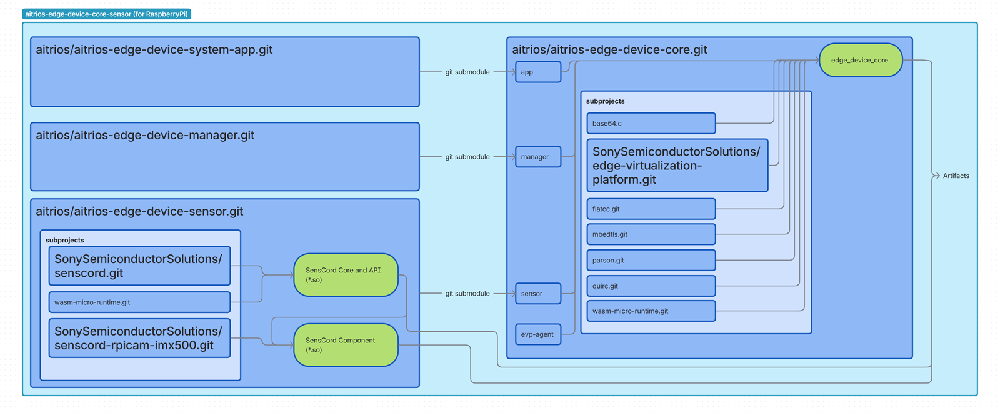

# Edge Device Core

## Overview

**Edge Device Core** is a core module for edge devices developed by Sony Semiconductor Solutions.  
This module provides essential functions to connect devices to the [AITRIOS Console](https://www.aitrios.sony-semicon.com/) and supports real-world edge AI operations.
By using Edge Device Core, developers can easily develop devices that can connect to the AITRIOS Console.

### Features

- Connect to the Console via MQTT
- AI model deployment
- Edge Application deployment
- Inference control
- Support Wasi-nn (WebAssembly System Interface for Neural Networks)

#### wasi-nn Support

Edge Device Core includes support for [wasi-nn](https://github.com/WebAssembly/wasi-nn), a WebAssembly System Interface for neural network inference. This enables:

- **Hardware-accelerated AI inference**: Utilize available hardware acceleration for optimal performance
- **Framework-agnostic model support**: Run models from various ML frameworks (ONNX, TensorFlow Lite, etc.)
- **Secure sandboxed execution**: AI applications run in a secure WebAssembly environment
- **Cross-platform compatibility**: Deploy the same AI applications across different hardware platforms (see [AITRIOS Edge AI Devices](https://www.aitrios.sony-semicon.com/edge-ai-devices) for compatibility information)

Wasi-nn allows WebAssembly applications to perform machine learning inference with minimal performance overhead while maintaining security and portability.

### Supported Environment

- Raspberry Pi OS + [Raspberry Pi Camera Module](https://www.raspberrypi.com/documentation/accessories/ai-camera.html)

### Related Repositories (Included in the Edge Device Core)

 - [aitrios/aitrios-edge-device-system-app](https://github.com/aitrios/aitrios-edge-device-system-app) (app)
 - [aitrios/aitrios-edge-device-manager](https://github.com/aitrios/aitrios-edge-device-manager) (manager)
 - [aitrios/aitrios-edge-device-sensor](https://github.com/aitrios/aitrios-edge-device-sensor) (sensor)
   - [SonySemiconductorSolutions/senscord](https://github.com/SonySemiconductorSolutions/senscord)
   - [SonySemiconductorSolutions/senscord-rpicam-imx500](https://github.com/SonySemiconductorSolutions/senscord-rpicam-imx500)
 - [SonySemiconductorSolutions/edge-virtualization-platform](https://github.com/SonySemiconductorSolutions/edge-virtualization-platform) (evp)



### Related Repositories (Used with the Edge Device Core)

 - [SonySemiconductorSolutions/local-console](https://github.com/SonySemiconductorSolutions/local-console)
 - [SonySemiconductorSolutions/aitrios-sdk-edge-app](https://github.com/SonySemiconductorSolutions/aitrios-sdk-edge-app)

## How to Build

For building the Edge Device Core for Raspberry Pi, you can choose between cross-compilation on a Linux host or native compilation directly on the Raspberry Pi.

### Cross-compilation (x86_64 host)

Build on a Linux x86_64 host machine using Docker/devcontainer for cross-compilation to ARM64 architecture.

- **Requirements**: Docker and devcontainer CLI, x86_64 Linux host
- **Setup guide**: [Cross-compilation instructions](docs/how_to_build_for_raspberry_pi.md#cross-compile-for-raspberry-pi-from-amd64-x86_64)

### Native compilation (arm64 host)

Build directly on the Raspberry Pi target device.

- **Requirements**: Raspberry Pi with Raspberry Pi OS
- **Setup guide**: [Native compilation instructions](docs/how_to_build_for_raspberry_pi.md#native-compile-on-raspberry-pi-aarch64-arm64)

## How to Use

For instructions on using the project on Raspberry Pi, please refer to the [How to use for Raspberry Pi](docs/how_to_use_for_raspberry_pi.md) document.

### For AITRIOS Console

Edge Device Core can connect to the AITRIOS Online Console for cloud-based device management. This option provides:

- Remote device management and monitoring
- AI model deployment from the cloud
- Secure MQTT communication with TLS encryption
- Real-time inference control and data collection

**Requirements:**
- AITRIOS Console account and valid device certificates
- Internet connectivity for cloud communication

**Quick setup:** Follow the [detailed setup guide](docs/how_to_use_for_raspberry_pi.md#option-a-using-aitrios-online-console) to configure your device certificates and connect to the AITRIOS Console.

### For Local Console

For development and testing purposes, Edge Device Core can work with a local MQTT broker without cloud connectivity. This option provides:

- Local development environment
- No internet dependency
- Simplified configuration without device certificates
- Integration with local console applications in Windows or Linux environments

**Requirements:**
- Network connectivity to the local broker

**Quick setup:** Follow the [local setup guide](docs/how_to_use_for_raspberry_pi.md#option-b-using-local-console-local-mqtt-broker) to configure a local MQTT broker connection.

**Local Console Application:** For a complete local development environment, see the [Local Console project](https://github.com/SonySemiconductorSolutions/local-console).

## Directory Structure
```
.
├── README.md                           # This file
├── LICENSE                             # License file
├── CODE_OF_CONDUCT.md                  # Community guidelines
├── CONTRIBUTING.md                     # Contribution guidelines
├── PrivacyPolicy.md                    # Privacy policy
├── SECURITY.md                         # Security policy and vulnerability reporting
├── .devcontainer/                      # Devcontainer settings for building the project
│   └── raspi/                          # For Raspberry Pi
├── .gitignore                          # Git ignore file
├── .gitmodules                         # Git submodule configuration
├── docs/                                # Documentation
├── meson.build                         # Meson build configuration
├── meson_options.txt                   # Meson build options
├── script/                             # packaging and configuration scripts
│   ├── mk-deb.sh                       # Debian package creation script
│   └── update_psm_db.py                # Update database script for connecting to AITRIOS Console
├── src/                                # Source code and submodules
├── subprojects/                        # dependencies managed by Meson
└── systemd/                            # systemd service configuration
    
```

## Contribution

We welcome contributions to this project!  
Issues and pull requests are welcome and we appreciate bug reports, feature requests, and any contributions from the community.

For details on how to contribute, please see [CONTRIBUTING.md](CONTRIBUTING.md).  
For our code of conduct, please see [CODE_OF_CONDUCT.md](CODE_OF_CONDUCT.md).

## Security

Please see the [SECURITY.md](SECURITY.md) file for information on reporting vulnerabilities and our security policy.

## License

This project is licensed under the Apache License 2.0.

Please see the [LICENSE](LICENSE) file for details.
