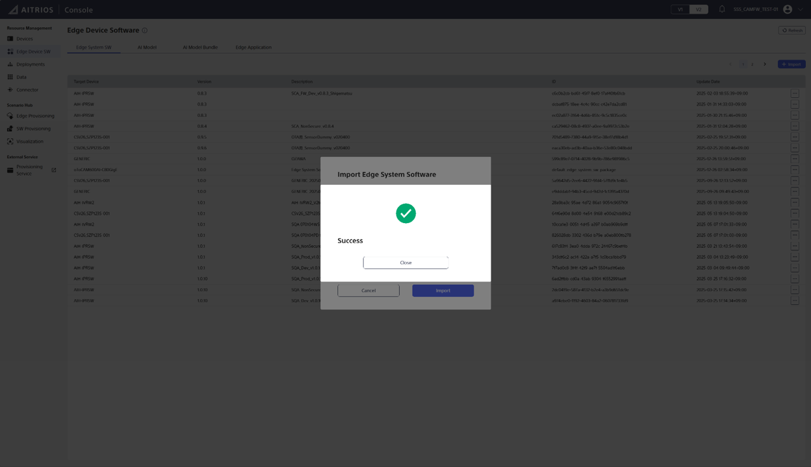
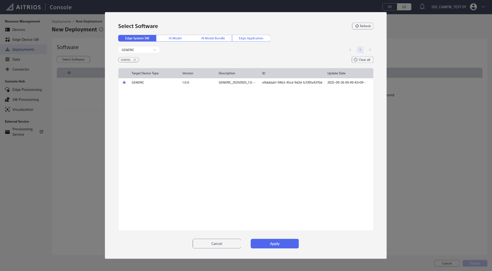
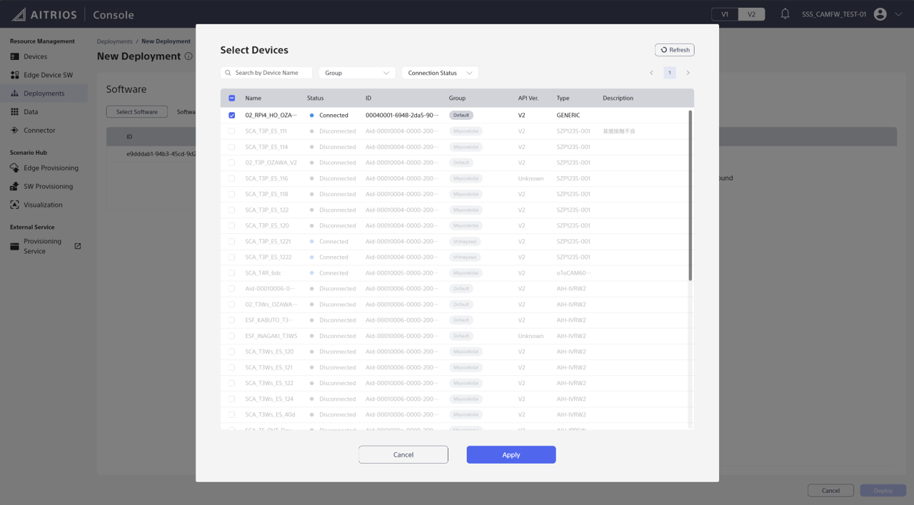
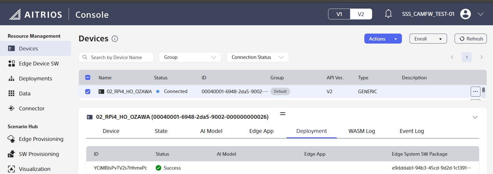
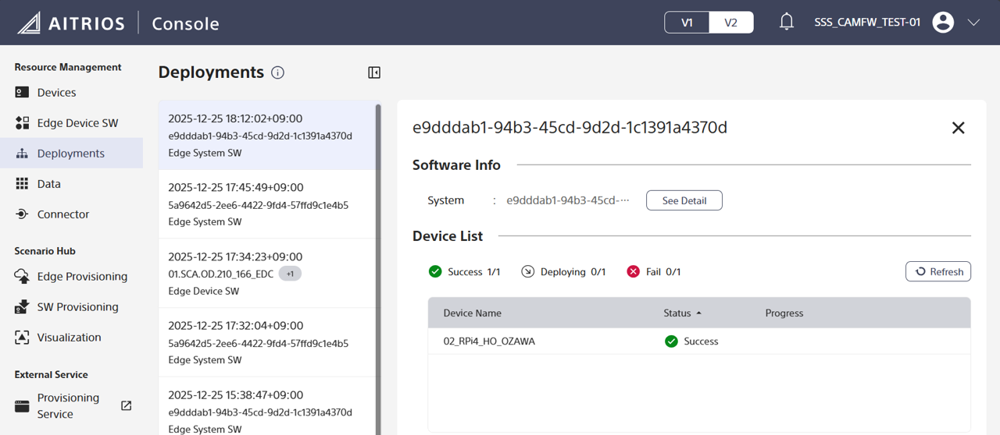
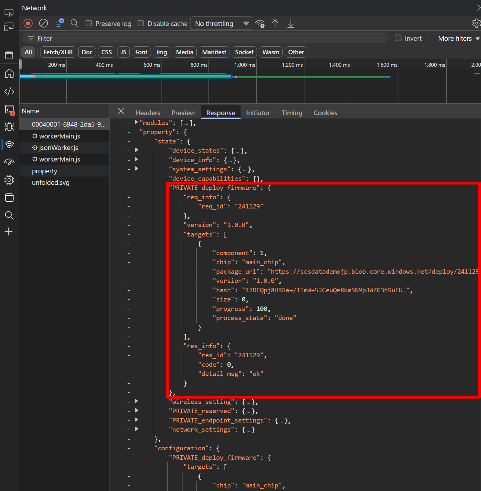

# How to use the OTA sample functionality

## Overview
This guide provides comprehensive step-by-step instructions for setting up and using
the Over-The-Air (OTA) update functionality in the Edge Device Core (EDC) project
from scratch.

Since OTA functionality is a system-level feature, it is not included in the EDC
module itself. Instead, we provide a sample implementation to demonstrate how to
integrate OTA functionality with EDC.

EDC provides an implementation of the AITRIOS Cloud Edge Interface protocol, which
defines an interface for OTA updates through the `PRIVATE_deploy_firmware` configuration.

### OTA Configuration Format

> **Note:**
> This section describes the configuration format for developers working with local MQTT environments
> or implementing custom OTA solutions. If you are using the SCS (AITRIOS Cloud Console), you can
> execute OTA updates through the UI without needing to understand this configuration format.

The expected configuration format is:

```json
{
    "PRIVATE_deploy_firmware": {
        "req_info": {"req_id": "hogefugapiyo123"},
        "targets": [
            {
                "component": 1,
                "chip": "main_chip",
                "version": "",
                "package_url": "",
                "hash": "",
                "size": 0
            }
        ]
    }
}
```

**Configuration Parameters:**

* **component**: Integer value `1` (fixed) - Indicates the target of OTA is system firmware
* **chip**: String value `main_chip` (fixed) - Represents the system firmware running on the main application processor
* **version**: Empty string (fixed) or omitted - OTA specification always updates to the latest EDC version
* **package_url**: Empty string (fixed) or omitted - System image download is handled automatically
* **hash**: Empty string (fixed) or omitted - Hash verification is handled automatically
* **size**: Integer value `0` (fixed) or omitted - Size is handled automatically

> **Important:**
> For the OTA specification, only `component` and `chip` are required with fixed values as shown above.
> The `version`, `package_url`, `hash`, and `size` parameters can be omitted. If specified, they must be
> empty strings or `0`, otherwise the configuration will be treated as an error.

**Minimal Configuration Example:**

```json
{
    "PRIVATE_deploy_firmware": {
        "req_info": {"req_id": "hogefugapiyo123"},
        "targets": [
            {
                "component": 1,
                "chip": "main_chip"
            }
        ]
    }
}
```

### OTA Process Workflow

When the edge device receives the OTA configuration:

1. **Script Execution**: The device executes the shell script `/sbin/edc_system_update.sh`
   - This script can be modified by customers as needed
   - The SSS-provided sample script performs the following operations:
     - Downloads and installs the latest version of EDC
     - If the device is already running the latest version, only version check is performed (no actual update)
     - Updates Raspberry Pi OS to the latest version

2. **Response Generation**: Based on the script's return value, the device sends a state response to the cloud
   - Return value `0`: System update succeeded → `process_state` returns `done`
   - Return value non-zero: System update failed → `process_state` returns `failed`

### OTA State Response Format

The device returns the following state format:

```json
{
    "PRIVATE_deploy_firmware": {
        "req_info": {"req_id": "hogefugapiyo123"},
        "targets": [
            {
                "component": 1,
                "chip": "main_chip",
                "package_url": "",
                "version": "0.3.6",
                "hash": "",
                "size": 0,
                "progress": 100,
                "process_state": "done"
            }
        ]
    },
    "res_info": {
        "res_id": "hogefugapiyo123",
        "code": 0,
        "detail_msg": "ok"
    }
}
```

**State Response Parameters:**

**req_info:**
- Returned as-is from the configuration

**targets:**
- **component**: Fixed value `1`
- **chip**: Fixed value `main_chip`
- **package_url**: Empty string
- **version**: 
  - On success: Updated version (or current version if already up-to-date)
  - On failure: Empty string (version retrieval may fail)
- **hash**: Empty string
- **size**: `0`
- **progress**: 
  - On success: `100`
  - On failure: `0`
- **process_state**: 
  - On success: `done`
  - On failure: `failed`

**res_info:**
- **res_id**: Carries forward the `req_info.req_id` (or the latest value for spontaneous state reports)
- **code**: 
  - On success: `0`
  - On failure: `13`
- **detail_msg**: 
  - On success: `ok`
  - On failure: `internal`

### Additional Info State

In addition to the `PRIVATE_deploy_firmware` state, the device also reports version information as a separate independent topic called `additional_info`:

```json
{
    "additional_info": {
        "edc_version": "v0.3.6",
        "senscord_version": "v0.1.29"
    }
}
```

**State Parameters:**

- **edc_version**: Currently running EDC version on the device
- **senscord_version**: Currently running Senscord version on the device

> **Note:**
> The `additional_info` topic provides real-time version information for the currently executing EDC and Senscord on the device.
> This is an independent state topic, separate from `PRIVATE_deploy_firmware`.
> Since EDC and Senscord have a one-to-one relationship, comparing the EDC version alone is sufficient to determine the update status.

### Device Reboot Behavior

After a system update, the device cannot autonomously determine whether it is safe to reboot.
Therefore, by default, the device does not reboot automatically and waits for an explicit reboot command.

If a reboot is required, users must explicitly issue a `reboot` direct command through the console.
Whether a reboot should be issued depends on the EDC package update status.

### Determining EDC Package Updates

`PRIVATE_deploy_firmware` is processed as a configuration. The update behavior is as follows:

**Scenario 1: Device boots with configuration already set**
- The device automatically updates to the latest version upon every startup
- For Raspberry Pi, the OTA specification always updates to the latest available version
- To determine if an update occurred, compare the `version` in `PRIVATE_deploy_firmware.targets` state with `edc_version` in `additional_info`
  - If the versions differ, an update has occurred and a reboot is required to apply the changes
  - If the versions match, the device is already running the latest version

**Scenario 2: Configuration set after device is running**
- The device updates to the latest version at the time the configuration is applied
- To determine if an update occurred, compare the `version` in `PRIVATE_deploy_firmware.targets` state with `edc_version` in `additional_info`
  - If the versions differ, an update has occurred and a reboot is required to apply the changes
  - If the versions match, the device is already running the latest version

**Scenario 3: Latest version already installed**
- Only version check is performed; no actual update occurs
- The device reports the current version in the state response
- In this case, `version` in `PRIVATE_deploy_firmware.targets` matches `edc_version` in `additional_info`

**Update Determination Logic:**

When the `PRIVATE_deploy_firmware` configuration is issued, the `version` field in the state response indicates:
- **Update successful**: Contains the newly installed EDC version
- **Update failed**: Contains an empty string ("")
- **Already up-to-date**: Contains the current version (same as `edc_version` in `additional_info`)

By comparing `PRIVATE_deploy_firmware.targets[0].version` with `additional_info.edc_version`:
- **Different versions**: An update has been applied → reboot required
- **Same versions**: No update needed → no reboot required
- **Empty string in version**: Update failed → no reboot needed

> **Note:**
> For Raspberry Pi, once the `PRIVATE_deploy_firmware` configuration is set, the device will
> automatically check for and install the latest version on every boot. There is no need to
> remove and re-apply the configuration to update to newer versions.

## Prerequisites

### Required Hardware
- Raspberry Pi 4 or higher (**recommended**), Raspberry Pi Zero 2 W
- microSD card (minimum 8GB, recommended 16GB or more)
- Power adapter (5V 2.5A or higher)
- Raspberry Pi AI camera module (IMX500)

### Required Software
- Raspberry Pi OS (64-bit, Debian Bookworm)
- Internet connection with a wired connection
- User must belong to the `video` group (check with `groups $(whoami)`)

### Required Credentials
- Project ID from your AITRIOS device management portal
- Console endpoint URL provided by AITRIOS
- Device certificates (`*_cert.pem` and `*_key.pem` files)

> **Note:**
> Please refer to the [AITRIOS Portal](https://www.aitrios.sony-semicon.com/) to obtain device certificates.

## Sample OTA Functionality

The `samples/ota` directory of the EDC project contains a sample implementation
for OTA functionality.

* **edc_system_update.sh**: A sample shell script that executes the OTA update.
  - Executes Raspberry Pi OS package updates using the apt utility (optional, can be skipped with `--skip-os`).
  - Downloads and installs the latest EDC package (including sensor package) from
    the EDC GitHub Releases page. Since this script is executed from EDC itself, a blue-green
    deployment architecture (see below) is implemented in this script.
  - Implements dual symbolic link management for both `/opt/edc` and `/opt/senscord`.

* **edge-device-core.service**: A systemd service file that starts the EDC
  daemon based on the blue-green deployment architecture.

### Blue-Green Deployment Architecture

Since the OTA script is executed from EDC, it cannot update EDC itself.
Therefore, a blue-green deployment architecture is required to update EDC.

The EDC package is installed in the system as follows:

```
/opt/
├── edc -> edcA                 # Symbolic link to active deployment
├── senscord -> edcA/opt/senscord # Symbolic link to active senscord installation
├── edcA/                       # Blue deployment
│   ├── bin/
│   │   └── edge-device-core
│   ├── lib/
│   │   └── libparameter_storage_manager.so
│   └── opt/                    # (from senscord deb package)
│       └── senscord/
└── edcB/                       # Green deployment
    ├── bin/
    │   └── edge-device-core
    ├── lib/
    │   └── libparameter_storage_manager.so
    └── opt/                    # (from senscord deb package)
        └── senscord/
```

When the current EDC is running from `edcA` (blue deployment), the OTA script will
install the new version of EDC to `edcB` (green deployment), and vice versa.

The symbolic link `/opt/edc` points to the currently active deployment and will
be updated to point to the new deployment after a successful update. Additionally,
`/opt/senscord` points to the senscord content within the active deployment to
support applications that expect senscord at a fixed path.

`edge-device-core.service` will always start the EDC daemon from `/opt/edc/`.

## Device-Side Setup: Complete Installation Guide

This section provides complete step-by-step instructions for setting up OTA functionality
on your edge device from scratch. Follow these steps in order.

### Step 1: Install IMX500 Firmware

The IMX500 firmware is required for the Raspberry Pi AI camera module to work properly.

> **Note:**
> If you have already installed the IMX500 firmware, you can skip this step.

```bash
sudo apt update && sudo apt full-upgrade
sudo apt install -y imx500-all
sudo reboot
```

After the reboot, reconnect to your edge device and continue to the next step.

### Step 2: Prepare Your Working Environment on the Edge Device

On the edge device, create a working directory and clone the repository.

```bash
# On the edge device: Create a working directory (you can choose any location)
mkdir -p ~/workspace
cd ~/workspace

# Clone the aitrios-edge-device-core repository
git clone https://github.com/aitrios/aitrios-edge-device-core.git
cd aitrios-edge-device-core
```

> **Note:**
> All commands in this section should be executed on the edge device (Raspberry Pi).
> In this guide, we use `~/workspace` as the working directory. Replace it with your preferred path if needed.

### Step 3: Remove Previous Installations (If Any)

On the edge device, if you have previously installed EDC or senscord packages using `apt`, remove them first
to avoid conflicts with the OTA deployment structure.

```bash
# On the edge device: Remove previous edge-device-core
sudo apt purge -y edge-device-core

# Remove previous senscord-edc-rpi
sudo apt purge -y senscord-edc-rpi
sudo rm -rf /opt/senscord
```

> **Note:**
> Skip this step if this is your first installation.

### Step 4: Set Up the OTA Update Script

On the edge device, copy the OTA update script to the system location and make it executable.

```bash
# On the edge device: Copy the script to a system location
sudo cp samples/ota/edc_system_update.sh /sbin/

# Make it executable (if not already)
sudo chmod +x /sbin/edc_system_update.sh

# Clean up files for create symbolic link
sudo rm -fr /opt/senscord
sudo rm -fr /opt/edc
```

### Step 5: Install EDC and Senscord Using OTA Script

On the edge device, run the OTA update script to download and install the latest versions of EDC and senscord.
This will also create the initial blue-green deployment structure.

```bash
# On the edge device: Run the update
# This will also create the initial blue-green deployment structure
sudo /sbin/edc_system_update.sh
```

> **What this script does:**
> - Downloads the latest `edge-device-core` binary and libraries from GitHub releases
> - Downloads the latest `senscord-edc-rpi` package from GitHub releases
> - Creates the blue-green deployment structure at `/opt/edcA` and `/opt/edcB`
> - Sets up symbolic links at `/opt/edc` and `/opt/senscord`

### Step 6: Configure the Systemd Service

On the edge device, deploy the systemd service file to enable automatic startup and service management.

```bash
# On the edge device: Stop the current service if it exists
sudo systemctl stop edge-device-core.service

# Copy the new service file
sudo cp samples/ota/edge-device-core.service /etc/systemd/system/
```

### Step 7: Create Database and Configuration Directory

On the edge device, create the directory for EDC's database and configuration files.

```bash
# On the edge device: Create the database directory
sudo mkdir -p /var/lib/edge-device-core

# Copy the database update script
sudo cp script/update_psm_db.py /var/lib/edge-device-core/

# Set the database path environment variable
export EDGE_DEVICE_CORE_DB_PATH=/var/lib/edge-device-core/db.sqlite3
```

### Step 8: Set Up Device Certificates

On the edge device, copy your device certificates to the system location.

> **Important:**
> Before running these commands, ensure you have transferred your device certificate files
> (`*_cert.pem` and `*_key.pem`) to the edge device. You can use `scp` or other file transfer methods
> to copy the certificate files from your development PC to the edge device.
> 
> Example using scp from your development PC:
> ```bash
> scp your_device_cert.pem your_device_key.pem pi@<edge_device_ip>:~/
> ```
> 
> Replace `../*_cert.pem` and `../*_key.pem` below with the actual paths to your certificate files on the edge device.

```bash
# On the edge device: Create the certificates directory
sudo mkdir -p /etc/evp

# On the edge device: Copy device certificate file (replace with your actual certificate file name)
sudo cp ../*_cert.pem /etc/evp/

# On the edge device: Copy device private key file (replace with your actual key file name)
sudo cp ../*_key.pem /etc/evp/
```

### Step 9: Configure MQTT and Platform Parameters

On the edge device, set the MQTT and platform parameters in the database.

> **Important:**
> Replace the following values with your actual credentials:
> - `PROJECT_ID`: Your AITRIOS project ID (e.g., "00ghoajjb3a2gjBdI1d7")
> - `CONSOLE_URL (MQTT endpoint URL)`: Your MQTT endpoint URL (e.g., "mqtt.evp2-tb.demo-jp.midokura.com")

```bash
# On the edge device: Set your project credentials
PROJECT_ID="your_actual_project_id"
CONSOLE_URL="your_mqtt_endpoint_url"

# Set MQTT and platform parameters
sudo python3 /var/lib/edge-device-core/update_psm_db.py --key PlStorageDataProjectID --value "${PROJECT_ID}" --db-file ${EDGE_DEVICE_CORE_DB_PATH}
sudo python3 /var/lib/edge-device-core/update_psm_db.py --key PlStorageDataEvpHubURL --value "${CONSOLE_URL}" --db-file ${EDGE_DEVICE_CORE_DB_PATH}
sudo python3 /var/lib/edge-device-core/update_psm_db.py --key PlStorageDataEvpHubPort --value 8883 --db-file ${EDGE_DEVICE_CORE_DB_PATH}
sudo python3 /var/lib/edge-device-core/update_psm_db.py --key PlStorageDataEvpIotPlatform --value TB --db-file ${EDGE_DEVICE_CORE_DB_PATH}
sudo python3 /var/lib/edge-device-core/update_psm_db.py --key PlStorageDataEvpTls --value 0 --db-file "${EDGE_DEVICE_CORE_DB_PATH}"
```

### Step 10: Configure Root Certificate

On the edge device, set the root certificate for TLS verification.

```bash
# On the edge device: Set root certificate
ROOT_CA_PATH="/etc/ssl/certs/ca-certificates.crt"
sudo python3 /var/lib/edge-device-core/update_psm_db.py --key PlStorageDataPkiRootCerts --value-file "${ROOT_CA_PATH}" --db-file ${EDGE_DEVICE_CORE_DB_PATH}
sudo python3 /var/lib/edge-device-core/update_psm_db.py --key PlStorageDataPkiRootCertsHash --value "$(sha256sum "${ROOT_CA_PATH}" | cut -d' ' -f1)" --db-file ${EDGE_DEVICE_CORE_DB_PATH}
```

### Step 11: Create Required Directories

On the edge device, create additional directories required for EDC operation.

```bash
# On the edge device: Create directory for EVP modules
sudo mkdir -p /evp_data/modules
```

### Step 12: Set Up udev Rules

On the edge device, configure udev rules for I2C device access.

```bash
# On the edge device: Copy udev rules
sudo cp udev/60-edc.rules /etc/udev/rules.d/

# Trigger udev to apply the rules
sudo udevadm trigger --subsystem-match=i2c
```

### Step 13: Start the EDC Service

On the edge device, now that everything is configured, start the EDC service.

```bash
# On the edge device: Reload systemd configuration
sudo systemctl daemon-reload

# Start the EDC service
sudo systemctl start edge-device-core.service

# Enable the EDC service to start automatically when the system boots
sudo systemctl enable edge-device-core.service
```

### Step 14: Verify the Service is Running

On the edge device, check the service status and logs to ensure EDC is running correctly.

```bash
# On the edge device: Check service status
sudo systemctl status edge-device-core.service

# View live logs
sudo journalctl -u edge-device-core.service -f
```

**Expected output:**

When edge-device-core starts successfully, you should see log messages like:

```
system_app_main.c ... [INF] Host[mqtt.evp2-tb.demo-jp.midokura.com]  # Your configured MQTT host
system_app_main.c ... [INF] Port[8883]                               # Your configured MQTT port
system_app_main.c ... [INF] ProjectId: [your_project_id]             # Your project ID
system_app_main.c ... [INF] Ether connected.                         # Network connection established
system_app_main.c ... [INF] NTP sync done.                           # Time synchronization completed
system_app_main.c ... [INF] agent connected to hub                   # Successfully connected to MQTT broker
```

**Connection status:**
- If you see `MQTT_ERROR_RECONNECT_FAILED`: This indicates that edge-device-core is unable to connect to the MQTT broker. Check your MQTT broker configuration and network connectivity.
- If you see `agent connected to hub`: This indicates that edge-device-core is successfully connected to the MQTT broker and ready for operation.

### Step 15: Stop the EDC Service (Optional)

On the edge device, if you need to stop the EDC service for any reason:

```bash
# On the edge device: Stop the EDC service
sudo systemctl stop edge-device-core.service
```

### Troubleshooting: Device-Side Setup

**Issue: Service started before database configuration (PS Mode activation)**

If you accidentally start the EDC service before completing the database configuration
(before Step 9), the service will start in PS mode and set the `QRModeStateFlag` in
the database to `0x77777777` (2004318071).

**Symptoms:**
- EDC starts in PS mode
- Database contains incorrect `QRModeStateFlag` value

**Solution:**

1. Stop the EDC service:
   ```bash
   sudo systemctl stop edge-device-core.service
   ```

2. Remove the incorrectly initialized database:
   ```bash
   sudo rm -f /var/lib/edge-device-core/db.sqlite3
   ```

3. Reconfigure the database by repeating Step 9 (Configure MQTT and Platform Parameters)
   and Step 10 (Configure Root Certificate)

**Issue: MODULE_DIR creation error**

If you see the following error in the logs:
```
evp_agent: No such file or directory: Failed to create MODULE_DIR /evp_data/modules
```

**Solution:**

Create the required directory (this is Step 11 of the setup):
```bash
sudo mkdir -p /evp_data/modules
```

Then restart the EDC service:
```bash
sudo systemctl restart edge-device-core.service
```

---

## SCS (Console) Operations

This section provides step-by-step instructions for executing OTA updates using the
AITRIOS Cloud Console (SCS).

### Prerequisites

Before proceeding with console operations, ensure you have completed the
[Device-Side Setup: Complete Installation Guide](#device-side-setup-complete-installation-guide).

### Step 1: Register Your Device with SCS

First, register your edge device with the AITRIOS Cloud Console. Follow the device
registration procedures provided in the AITRIOS documentation.

### Step 2: Import the OTA GENERIC Package

Import the OTA package for GENERIC devices into the console.

1. Navigate to **Console V2** → **Edge Device SW**
2. Click the **+ Import** button in the top right corner
3. Upload the GENERIC package file: [`samples/ota/GENERIC_20250925_1.0.0_prod.zip`](../samples/ota/GENERIC_20250925_1.0.0_prod.zip)
4. Click **Import**

Upon successful import, you will see a confirmation screen like this:



### Step 3: Execute Deployment from the UI

Now you can deploy the OTA update to your device.

#### 3.1. Select Software

1. Navigate to **Console V2** → **Deployments**
2. Click the **+ Deploy** button in the top right corner
3. Click **Select Software**

In the software selection screen, choose the GENERIC software package you just imported.
If there are many packages listed, you can filter by **Target Device Type: GENERIC**.



4. Click **Apply** after selecting the software

#### 3.2. Select Devices

1. Click **Select Devices**
2. Select your device from the list



3. Click **Apply**

#### 3.3. Confirm and Deploy

1. Review the selected software and devices to ensure they are correct
2. Click **Deploy** to start the software update


This will initiate the OTA update process on your device.

### Step 4: Verify the Results

You can verify the update status in multiple ways:

#### Option A: Check from Device Details

1. Navigate to **Devices** → Select your device → **Deployment** tab

You will see the deployment status and results:



#### Option B: Check from Deployments List

1. Navigate to **Deployments**

You can also verify the deployment status from the deployments list:



#### Option C: Inspect PRIVATE_deploy_firmware State (Advanced)

If you want to inspect the `PRIVATE_deploy_firmware` state details, you can use browser
developer tools (for Microsoft Edge):

1. Click the three-dot menu in the top right corner
2. Select **More Tools** → **Developer Tools**
3. Navigate to the **Network** tab
4. Monitor the network requests to see the state updates



### Step 5: Reboot the Device

After a successful OTA update, you must reboot the device to apply the changes.

1. Navigate to **Devices** → Select your device
2. Issue a **reboot** direct command through the console

The device will reboot and start running the newly updated EDC version.

### Important Notes

> **Configuration Persistence:**
> Once you register a firmware deployment from the console, the device will receive
> the configuration and perform update verification every time EDC restarts and connects
> to the console. If you want to disable this behavior, you need to re-register the
> device in the console.

### Troubleshooting

**Deployment Failed:**
- Check the device logs using `sudo journalctl -u edge-device-core.service -f`
- Verify network connectivity between the device and the console
- Ensure the device certificates are valid and properly configured

**Update Not Applied After Reboot:**
- Verify that the deployment status shows as successful
- Check that the symbolic links `/opt/edc` and `/opt/senscord` point to the new deployment
- Review the system logs for any errors during the update process
